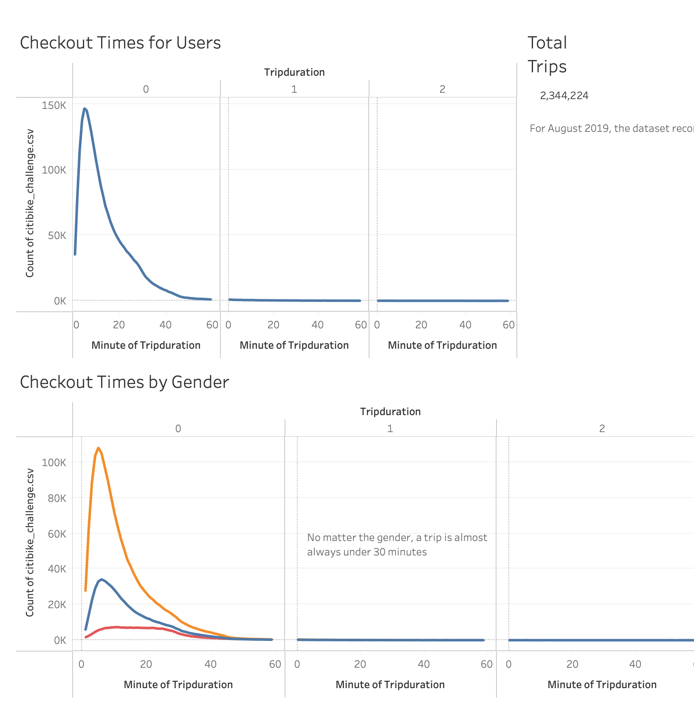
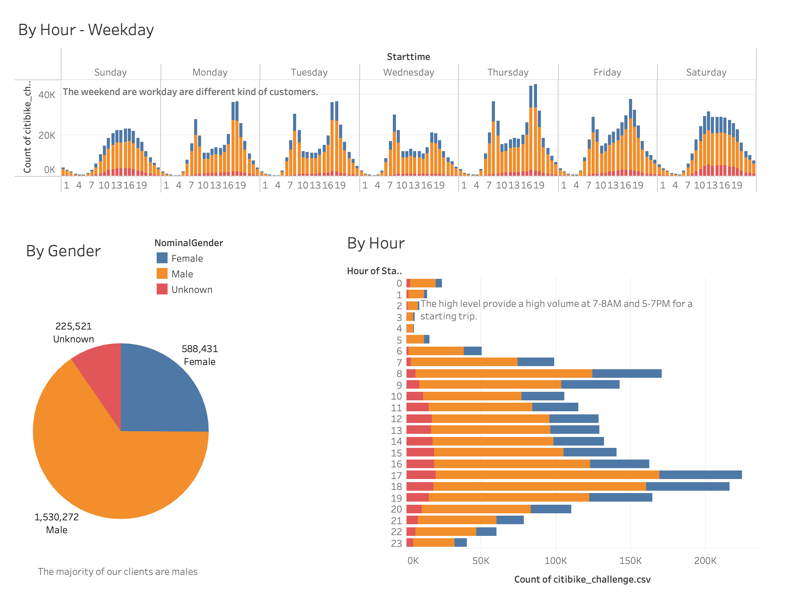
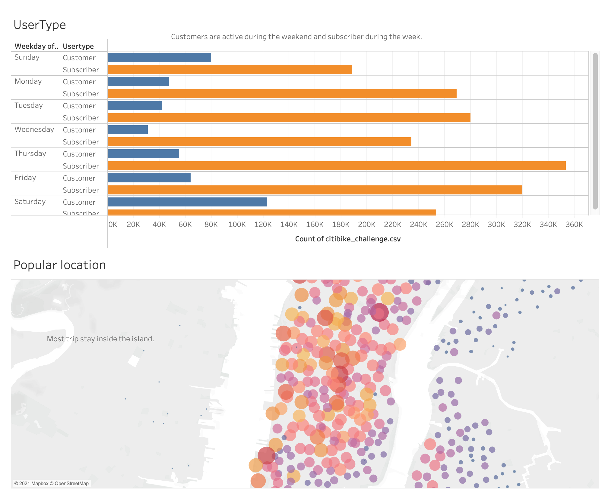

## Project Overview

This project is a visualization of New York Citi Bike data (August 2019) in order to explore the viability of a bike-sharing business.

### Deployed Interactive Interface - Tableau Public

> https://public.tableau.com/profile/pierre.olivier.boisvert#!/vizhome/Challenge_16174085472930/NYCCitibike

## Resources

- Dataset: 201908-citibike-tripdata.csv.zip (https://s3.amazonaws.com/tripdata/index.html)
- Software: Python 3.8.5, Anaconda Navigator 1.10.0 Tableau Public 2021.1.0

## Results

### Activity during the month

- There were over 2.3 million rides for the month of August 2019.
- During the week users are subscribers and during the weekend customer like to use the bike sharing service.
- There is a wide range of the age of the users. Male tend to use the serivce more often than women and the aveerage trip is below 30 minutes.

### Activity during the day

- Highest activity hours are from 6AM to 8AM and 5:00 PM to 7:00 PM and require the most resources mobilized to manage bikes and client customer.
- During the weekend, the activity seems slower, but steady.

### Activity duration

- No matter the day or the gender, a bike trip is almost always below 30 minutes and do not go over 45 minutes often.

### Location matter

- Most ride start locations are in the touristic or business areas on the island of NYC.

## Summary

- Adter the visualisation, we can confirm the popularity of this service in in New York during the month of August 2019.

- The majority of the trips were in Manhattan Island (by male users during morning and evening rush hours).

- We can see this service as a cheaper alternative to the Metro or other public transportation and a way to practive sport.

### Further analysis:

- Having multiple dataset to see if the service is popular during the winter.
- Aggregation data on promotions to encourage customer for longer trips.
